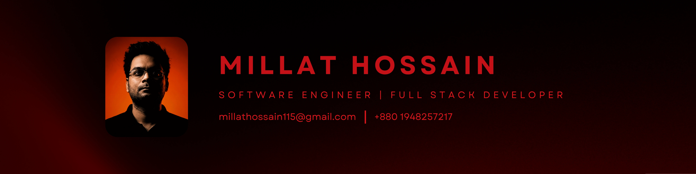
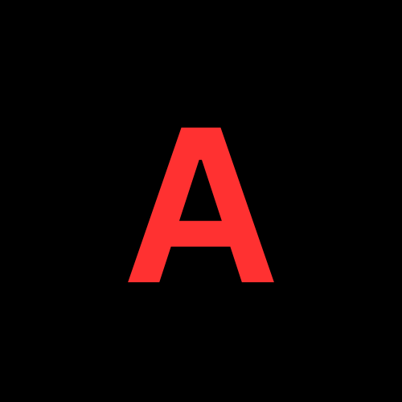
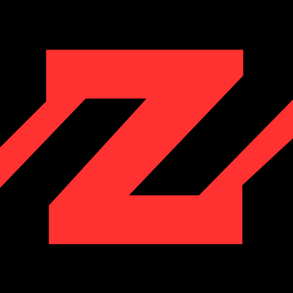

  

<h1 align="center"><code>Millat Hossain</code></h1>
<h3 align="center"><code>FULL-STACK DEVELOPER | SOFTWARE ENGINEER</code></h3>

  
  
  
  

  

---

## ⚡ <code>ABOUT ME</code>

> Software engineer from Dhaka, Bangladesh, focused on building responsive, database-driven web applications. Work across polished React interfaces, RESTful backend services, authentication flows, and practical database design with a strong eye for clean user experience.

- 🚀 **`Building`**: Full-stack web apps with React, Node.js, Express, PHP, MySQL, and MongoDB.
- 🎯 **`Focus`**: Maintainable UI systems, API structure, role-based dashboards, and seamless deployments.
- 📈 **`Learning`**: TypeScript, Next.js, Express.js, MongoDB, and scalable REST API design.

---

## 🛠️ <code>TECH STACK</code>

  <b>💻 <code>Frontend</code></b> 
  
  
  
  
  
  
  
  

  <b>⚙️ <code>Backend & APIs</code></b> 
  
  
  
  
  
  
  

  <b>🗄️ <code>Databases & ORM</code></b> 
  
  
  
  
  

  <b>🛠️ <code>Tools & DevOps</code></b> 
  
  
  
  
  
  
  

---

## 🔥 <code>FEATURED PROJECTS</code>

<table>
  <tr>
    <td width="50%" valign="top">
      <h3> <code>Artisane</code></h3>
      
<code>E-commerce storefront, customer dashboard, admin operations, super-admin management, payments, courier integration, and analytics.</code>

      

        
        
        
        
      

      

        
        
        
      

    </td>
    <td width="50%" valign="top">
      <h3> <code>ZaDEX</code></h3>
      
<code>Role-based parcel delivery system for customers, riders, and admins with booking, tracking, payments, JWT auth, and dashboards.</code>

      

        
        
        
        
      

      

        
        
        
      

    </td>
  </tr>
</table>

---

## 📊 GitHub Stats

  
  

  

---

## 📫 Connect With Me

  
  
  

  

